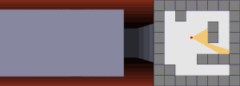
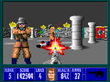

# Assignment proposal
## What I want to do:

I want to create an Raycaster Engine, similar to the one used in 
Wolfenstein 3D in 1992. The idea of the engine is to raycast the
distance to the walls only in one dimension and derive the shape
and texture of the walls only from that. To display objects I 
want to use billboards. I also want to add a rasterizer to be 
able to display 3D objects as well.

## What technology I'd like to use:

I'd like to use C++ with OpenGL, but only use it for
cross plattform window management. The rendering will be done
by only writing to the framebuffer. More complex functions will be
avoided. 

## How it is going to look

As this will be a implementation and extension of the Wolfenstein
3D Engine and textures from teh game will be used I expect the result
to look somewhat similar to the original game. A screenshot is attached below.

